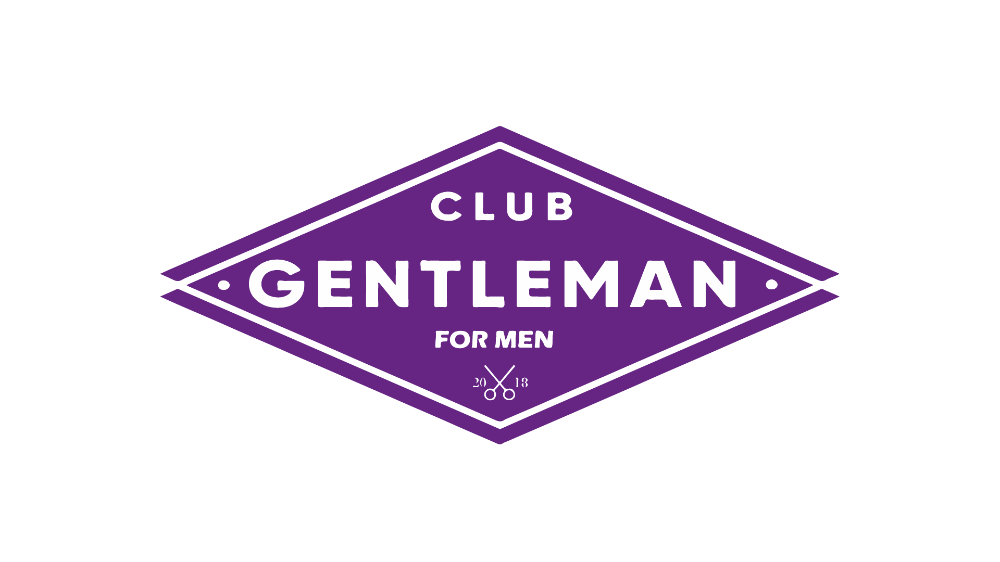

<div align="center">
  
  <h1>💈 Club Gentleman For Men — Barber SaaS</h1>
  <p><strong>Plataforma de Agendamiento Premium y Administración de Barberías</strong></p>

  [](https://nextjs.org/)
  [](https://tailwindcss.com/)
  [](https://supabase.com/)
  [](https://www.framer.com/motion/)
</div>

<br/>

## 🎯 Descripción del Proyecto
Este ecosistema web fue diseñado para elevar la experiencia operativa de "Club Gentleman For Men". Está dividido estratégicamente en dos partes:
1. **Landing Page Frontal:** Una impresionante vitrina (Urban Dark / Glassmorphism) que permite a los clientes descubrir el portafolio, conocer al equipo, encontrar la ubicación interactiva y agendar citas fácilmente.
2. **Dashboard de Barberos (SaaS backend):** Un panel administrativo cerrado de uso exclusivo para los empleados de la barbería. Sirve para gestionar horarios militares (configuración por días/horas), biografía, perfil fotográfico y su propio catálogo de servicios de forma soberana.

---

## ✨ Características Principales
### Para el Cliente
- 🗓️ **Booking Wizard Anti-Colisiones:** Selecciona servicio, barbero, fecha y hora. El asistente informático realiza cálculos trigonométricos para ocultar bloqueos, cruces de citas y horas de almuerzo de los barberos.
- 👨‍🎤 **Vitrina del Equipo Dinámica:** Las biografías y fotos se cargan directamente desde la base de datos a medida que el Barbero actualiza su perfil en la nube.
- 📍 **Mapa Geográfico:** Integración de geolocalización cliqueable apuntando a la sede física con fotos reales.

### Para el Barbero (Dashboard)
- 🔒 **Row Level Security (RLS):** Cada barbero tiene autonomía sobre su catálogo, pero jamás puede borrar ni editar los servicios/citas de los demás empleados.
- ⏰ **Motor de Horarios (JSONB):** Flexibilidad para apagar o encender días laborales, fijar la hora de entrada/salida y establecer los recesos exactos de comida (impacta el Booking Wizard al milisegundo).
- 💇 **Gestor de Catálogo de Servicios:** Interfaz para crear y valuar recortes con una validación segura que te avisa si intentas eliminar un corte vinculado a citas futuras de tus clientes.
- ☁️ **Almacenamiento Cloud:** Integración de perfiles y `avatars` protegidos con permisos de lectura abierta y escritura restrictiva al propietario a través del Storage de Supabase.

---

## 🛠️ Stack Tecnológico
- **Core:** Next.js 15 (App Router), React 19, TypeScript
- **Estilos & UI:** Vanilla Tailwind CSS (v4), Framer Motion (para transiciones hermosas fluidas y Glassmorphism), Lucide React (Iconografía SVG escalable).
- **Backend / BaaS:** Supabase Auth (Sistema de registro/login), Supabase Storage (Subida de fotos), PostgreSQL avanzado (Enums, Jsonb, Triggers y Callbacks).
- **Notificaciones:** Sonner (Toast notifications limpias).
- **Gestor de Fechas:** Date-fns (Validaciones multi-regionales de días).

---

## 🚀 Instalación y Configuración Local

Sigue estos pasos para desplegar el entorno de desarrollo en tu máquina.

### 1. Clonar Repositorio e Instalar Dependencias
```bash
git clone <URL_DEL_REPOSITORIO>
cd barber-app
npm install 
```

### 2. Configurar Variables de Entorno
Crea un archivo llamado `.env.local` en la raíz del proyecto e ingresa tus credenciales de Supabase:
```env
NEXT_PUBLIC_SUPABASE_URL=tu_url_de_supabase_aqui
NEXT_PUBLIC_SUPABASE_ANON_KEY=tu_clave_anonima_aqui
```

### 3. Construir la Base de Datos (PostgreSQL en Supabase)
Dirígete al SQL Editor en el panel web de Supabase y en orden:

1. Ejecuta el esquema base ubicando el contenido de `schema.sql`. (Crea las tablas `profiles`, `services`, `appointments`, políticas RLS).
2. Ejecuta el disparador ubicado en `supabase_trigger.sql`. (Este automatiza las carpetas del perfil para cada barbero una vez que llenan el Sign Up).
3. Añade el motor de guardado visual de Avatares corriendo este SQL manual:
```sql
INSERT INTO storage.buckets (id, name, public) VALUES ('avatars', 'avatars', true);
CREATE POLICY "Publicar avatares al mundo" ON storage.objects FOR SELECT USING ( bucket_id = 'avatars' );
CREATE POLICY "Subida autorizada" ON storage.objects FOR INSERT TO authenticated WITH CHECK ( bucket_id = 'avatars' );
CREATE POLICY "Actualizacion autorizada" ON storage.objects FOR UPDATE TO authenticated USING ( bucket_id = 'avatars' );
```

### 4. Lanzar el Servidor en Vivo
```bash
npm run dev
# Abrir http://localhost:3000 
```

---

## 📂 Estructura del Código Fuente
```text
barber-app/
├── schema.sql                     # Arquitectura maestra de PostgreSQL
├── supabase_trigger.sql           # Gatillos asíncronos para perfilado
├── src/
│   ├── app/
│   │   ├── page.tsx               # Landing Page Principal / Front-End
│   │   ├── login/                 # Portal de Autenticación de Barberos
│   │   └── dashboard/             # Panel Administrativo Intranet
│   │       ├── profile/           # Configuración de biometría y horarios
│   │       ├── services/          # Catálogo CRUD de cortes de cabello
│   │       └── page.tsx           # Resumen general de la agenda diaria
│   ├── components/
│   │   ├── booking/               # Herramienta paso-a-paso de reservas
│   │   ├── home/                  # Vitrina de empleados (BarbersList)
│   │   └── layout/                # StaticHeader
│   ├── lib/
│   │   ├── supabase/              # Clientes SSR para Node y Browser
│   │   └── utils.ts               # Merger de clases Tailwind (cn)
│   └── types/
│       └── types_db.ts            # Intérpretes de Postgres generados 
└── tailwind.config.ts             # Directrices del Urban Dark Premium
```

---

## 🔒 Autor y Mantenimiento
Desarrollado como Sistema Operativo Integral.
**Diseñado para:** Club Gentleman For Men.
**Arquitectura Impulsada con:** Inteligencia Artificial (Next.js & Supabase Engine). 
> "Más que estilo, una actitud de caballeros."
